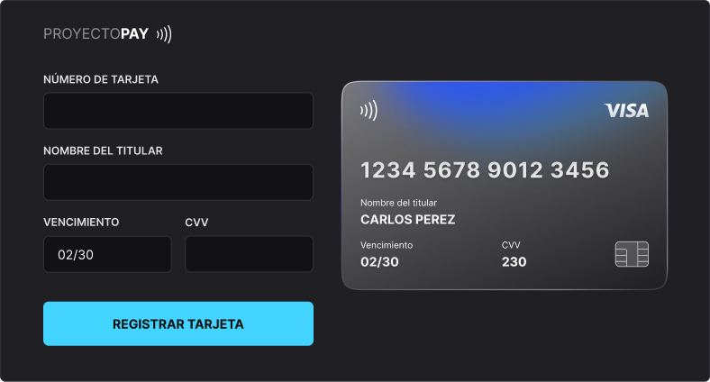

<h1 align="center"> ProyectoPay </h1>

Proyecto desarrollado durante un evento exclusivo y gratuito relizado por Rocketseat, para promover la enseñanza  de tecnologias WEB.

 

  

## 🚀 Tecnologias

Este proyecto fue desarrollado con las siguientes tecnologias:

- HTML y CSS
- JavaScript y JSON
- [Node e NPM](https://nodejs.org/)
- [Vite](https://vitejs.dev/)
- [iMask](https://imask.js.org)

## 💻 Proyecto

Proyectopay es un componente que simula un formulario de relleno de tarjeta de credito, en el cual es posible rellenar las mascaras a los inputs y actualizar elementos HTML via DOM.

## 🔖 <h1 id="layout"> Layout </h1>

Puedes visualizar el layout original del proyecto a travez [DE ESTE LINK](https://www.figma.com/file/gpqavL469k0pPUGOmAQEM9/Explorer-Lab-%2301/duplicate).

## :memo: Licencia

Este proyecto está sobre licencia MIT.

---

Hecho con ♥ junto a Rocketseat :wave:
